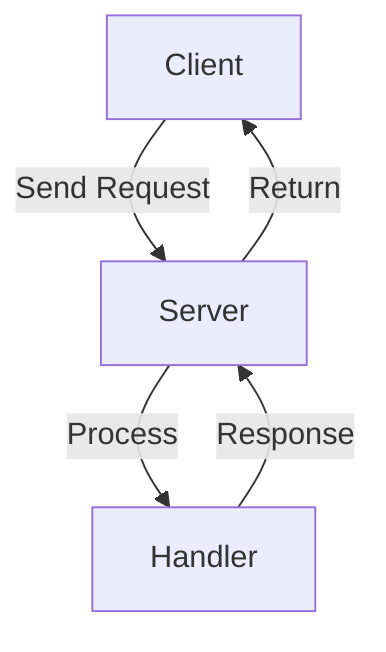

# PointSub


[](https://goreportcard.com/report/github.com/dep2p/pointsub)
[](https://godoc.org/github.com/dep2p/pointsub)
[](https://github.com/dep2p/pointsub/actions/workflows/ci.yml)

PointSub 是一个基于 dep2p 的点对点通信库，提供简单易用的 API 实现节点间的消息传递。

## 架构



## 特性

- 🚀 高性能：优化的连接池管理
- 🔒 安全：支持加密传输
- 🔄 可靠：自动重试机制
- 📦 压缩：支持消息压缩
- 🌐 扩展：灵活的协议支持

## 快速开始

### 安装

```bash
go get github.com/dep2p/pointsub
```

### 基本使用

```go
// 创建服务端
server, err := pointsub.NewServer(host)
if err != nil {
    log.Fatal(err)
}

// 注册处理函数
server.Start("/echo/1.0.0", func(req []byte) ([]byte, error) {
    return req, nil
})

// 创建客户端
client, err := pointsub.NewClient(host)
if err != nil {
    log.Fatal(err)
}

// 发送请求
resp, err := client.Send(ctx, peerID, "/echo/1.0.0", []byte("hello"))
```

## 性能指标

| 指标 | 值 |
|------|-----|
| 最大并发连接 | 10000 |
| 平均响应时间 | <10ms |
| 吞吐量 | >5000 QPS |

## 贡献指南

1. Fork 项目
2. 创建特性分支 (`git checkout -b feature/amazing-feature`)
3. 提交更改 (`git commit -m 'Add amazing feature'`)
4. 推送分支 (`git push origin feature/amazing-feature`)
5. 创建 Pull Request

## 许可证

本项目采用 MIT 许可证 - 详见 [LICENSE](LICENSE) 文件

## 主要特性

- 基于 dep2p 的流式通信
- 提供标准的 net.Conn 和 net.Listener 接口实现 
- 支持多路由、NAT 穿透和流复用
- 使用 Peer ID 进行寻址，无需传统的 host:port 方式
- 可配置的连接超时、并发控制、资源限制等
- 支持同一个 Host 同时作为服务端和客户端使用
- 支持多节点之间的全双工通信
- 内置连接池管理和自动重试机制
- 支持消息大小限制和压缩

## 使用限制

- dep2p hosts 不能自己连接自己
- 客户端不能向自己发送请求
- 每个 Host 需要唯一的 Peer ID
- 同一个 Host 上的不同协议需要使用不同的 Protocol ID
- 消息大小受 MaxBlockSize 限制（默认32MB）

## 配置选项

### 服务端选项

- WithMaxConcurrentConns(n int)：设置最大并发连接数，默认1000
- WithServerReadTimeout(d time.Duration)：设置读取超时，默认30秒
- WithServerWriteTimeout(d time.Duration)：设置写入超时，默认30秒
- WithServerBufferPoolSize(n int)：设置缓冲池大小，默认4KB
- WithServerCleanupInterval(d time.Duration)：设置清理间隔，默认5分钟

### 客户端选项

- WithReadTimeout(d time.Duration)：设置读取超时，默认30秒
- WithWriteTimeout(d time.Duration)：设置写入超时，默认30秒
- WithConnectTimeout(d time.Duration)：设置连接超时，默认5秒
- WithMaxRetries(n int)：设置最大重试次数，默认3次
- WithCompression(enable bool)：设置是否启用压缩，默认true

### 服务端配置 (ServerConfig)

- ReadTimeout：读取超时时间（默认30秒）
- WriteTimeout：写入超时时间（默认30秒）
- MaxConcurrentConns：最大并发连接数
  - 初始值：1000
  - 最小值：100
  - 最大值：10000
  - 动态调整：根据负载自动增减
- EnableCompression：是否启用压缩（默认true）

### 客户端配置 (ClientConfig)

- ReadTimeout：读取超时时间（默认30秒）
- WriteTimeout：写入超时时间（默认30秒）
- ConnectTimeout：连接超时时间（默认5秒）
- MaxRetries：最大重试次数（默认3次）
- RetryInterval：重试间隔时间（默认1秒）
- MaxBlockSize：最大数据块大小（默认32MB）
- EnableCompression：是否启用压缩（默认true）
- - MaxIdleConns：最大空闲连接数（默认100）
- - IdleConnTimeout：空闲连接超时时间（默认5分钟）
- - MaxTotalConns：总连接数限制（默认100）

### 连接管理

- 动态连接数调整
  - 自动根据系统负载调整并发连接数
  - 增长率：10%
  - 收缩率：10%
  - 触发条件：
    - 当负载因子 > maxLoadFactor 时减少连接数
    - 当负载因子 < maxLoadFactor*0.5 时增加连接数
- 连接数限制
  - 最小值(MinConcurrentConns)：100，确保基本服务能力
  - 最大值(MaxConcurrentConns)：10000，防止资源耗尽
  - 动态范围：在最小值和最大值之间自动调整
- 负载计算
  - 负载因子 = 当前活跃连接数 / 最大并发连接数
  - 实时监控和调整
  - 防止系统过载

## 使用方式

### 服务端使用

1. 创建 dep2p Host:

```go
    serverHost, err := dep2p.New()
    if err != nil {
        // 处理错误
    }
    defer serverHost.Close()
```

2. 创建服务端实例:

```go
    server, err := pointsub.NewServer(serverHost,
        pointsub.WithMaxConcurrentConns(1000),
        pointsub.WithServerReadTimeout(30*time.Second),
        pointsub.WithServerWriteTimeout(30*time.Second),
    )
    if err != nil {
        // 处理错误
    }
    defer server.Stop()
```

3. 定义消息处理函数:

```go
    handler := func(request []byte) ([]byte, error) {
    // 处理请求并返回响应
    return response, nil
    }
```

4. 启动服务:

```go
    protocolID := protocol.ID("/test/1.0.0")
    err = server.Start(protocolID, handler)
    if err != nil {
    // 处理错误
    }
```

### 客户端使用

1. 创建 dep2p Host:

```go
    clientHost, err := dep2p.New()
    if err != nil {
        // 处理错误
    }
    defer clientHost.Close()
```

2. 创建客户端实例:

```go
    client, err := pointsub.NewClient(clientHost,
        pointsub.WithReadTimeout(30*time.Second),
        pointsub.WithWriteTimeout(30*time.Second),
        pointsub.WithMaxRetries(3),
        pointsub.WithConnectTimeout(5*time.Second),
    )
    if err != nil {
        // 处理错误
    }
    defer client.Close()
```

3. 连接到服务端:

```go
    err = clientHost.Connect(context.Background(), serverHost.Peerstore().PeerInfo(serverHost.ID()))
    if err != nil {
    // 处理错误
    }
```